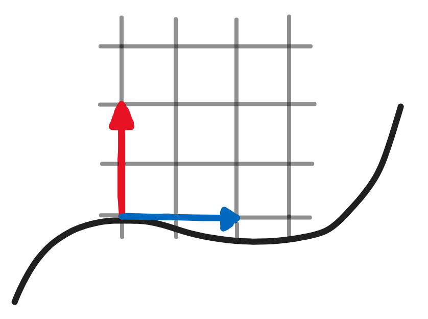
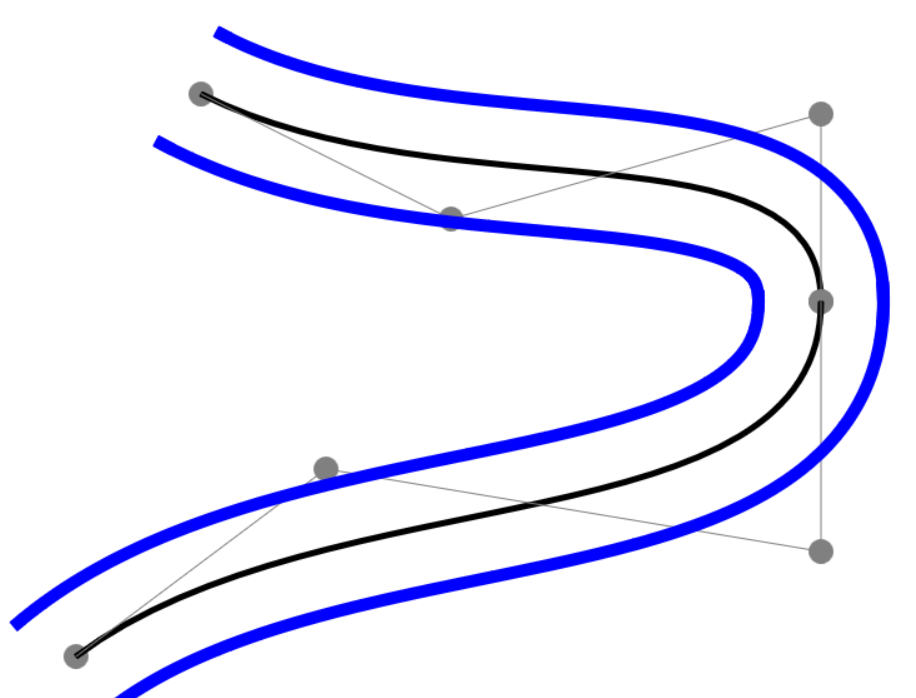

## DNA Devlog #2 - 6/17/2025
# *Deriving* local coordinates

In order to get the local coordinate spaces on a curve, I need to find the curve's tangent at that point. I wrote a function for this, which involved taking some derivatives!
Luckily, I like derivatives.

## Explanation
###### [Skip to Implementation](#implementation)

If you don't know much about curves or splines, you may be wondering,

*"Why do we need a tangent vector to find the local space?"*

Or,

*"Wait, what does 'local coordinate space' mean?"*

Well, I can explain it all with some crappy diagrams!

In the image below, there is a Bézier curve.

The blue vector is its tangent vector at the point it comes from. The red vector is the normal vector at that point, i.e. a vector orthogonal to the tangent vector.

With those two, you can access a local Cartesian coordinate space, which is helpful for drawing double helices around a Bézier curve.

If you don't know much (or any) linear algebra and want to learn more, here is a link to an explanation of what I just mentioned in more detail.

[Bases and coordinate systems - Understanding Linear Algebra](https://understandinglinearalgebra.org/sec-bases.html)

## Implementation

Here's what getting the coordinate space can do: Draw the outline of a DNA strand!

## Bonus

Here's a recording of me doing those derivatives. I'm 99.9999999999999999% sure I made no errors, because the code works well.

[Doing DNA Derivatives - Devlog Deux](https://youtu.be/37sDUqLihXc)

[<-- Previous Devlog](DNA_DEVLOG_1.md)   [Next Devlog -->](DNA_DEVLOG_3.md)