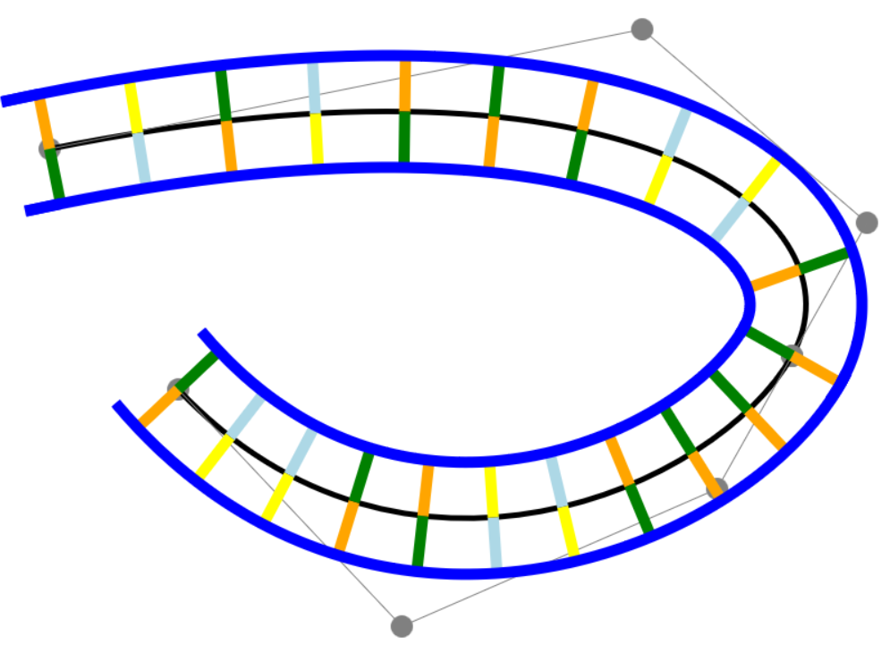

## DNA Devlog #4 - 6/19/2025
# Equal spacing for all!

## Explanation
###### [Skip to Implementation](#implementation)

Bézier curves are not uniform in their movement. Some parts of the curve have a higher velocity than others, which makes the spacing between molecules uneven when interpolating linearly over one. Trying to fix this issue led me down a rabbit hole online about arc-length parametrization during which I learned some new techniques and math to help me with handling Béziers.

The method I used in the end was one I found on a stack exchange conversation. It goes as follows:

- Use numerical integration to find a time-to-arclength map.
- Invert the map using binary search and linear interpolation for precision.
- Use this map as a lookup table and update it when points change.

With this, I am able to make equally spaced DNA parts!

## Implementation

I created a Bézier class to store points and parametrizations. Here is that class.

Here's the outcome of the method, creating equally spaced molecules no matter how stretched the curve is!

 
 

[<-- Previous Devlog](DNA_DEVLOG_4.md)
