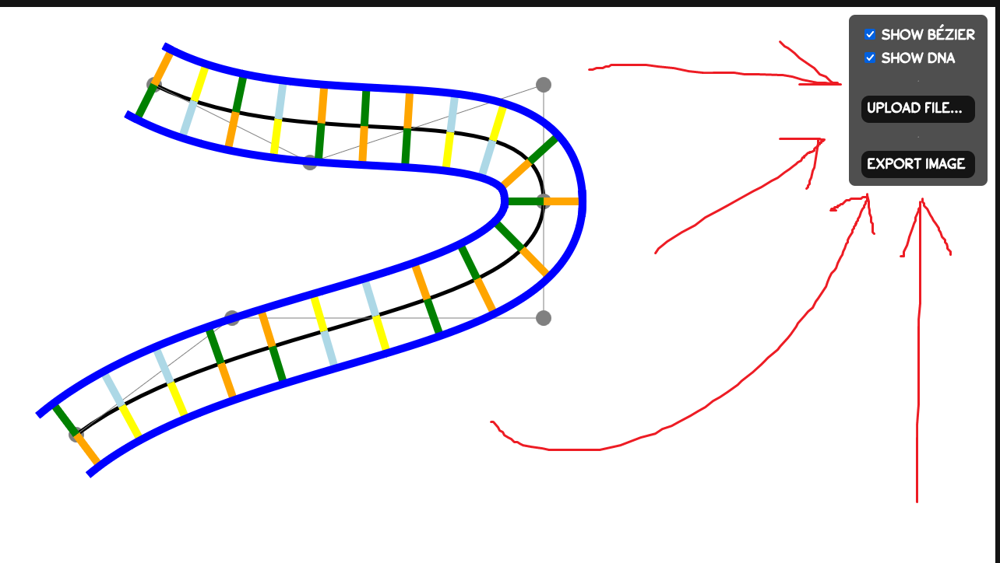
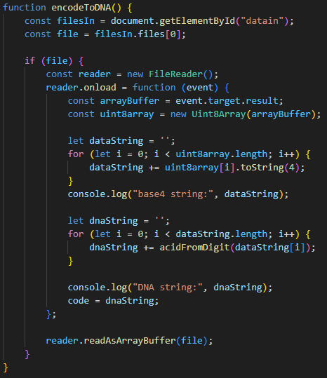

## DNA Devlog #6 - 6/25/2025
# Files in, files out

## Explanation

My goal this whole time has been to encode DATA into DNA, and so far, there's not much data coming in nor out. But I fixed it!

Now, it's possible to input a file from your computer and then get an image of DNA from it!
You can do everything from this helpful little panel here.

## Implementation

I did this with some simple-ish file reading code, where it reads the file as an array of bytes, and then returns a base 4 string.
Here's the function that does that.

It looks like I'm almost done with my project, as everything's working pretty well. But there are definitely things I could do to make it even better, and from here on out, changes will likely be small or simple improvements.

Thanks for reading up to here!

 
 

[<-- Previous Devlog](DNA_DEVLOG_5.md)   [Next Devlog -->](DNA_DEVLOG_7.md)