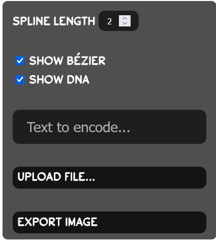

## DNA Devlog #7 - 6/30/2025
# OK, maybe only files *out*

## Explanation

Most files are way too big to be reasonably converted to a good image.
I probably should have thought of that already, but I'm fixing it now, so it's probably file. I mean fine.

## Implementation

Uploading files can still be done, but now there's a convenient text field for just encoding a simple message.

I've also added a way to change the number of Bézier curves in your spline.

My next plan is to make a button for closing the panel, because right now it kinda takes up a lot of space. Here's what that'll look like.

 
 

[<-- Previous Devlog](DNA_DEVLOG_6.md)   [Next Devlog -->](DNA_DEVLOG_8.md)