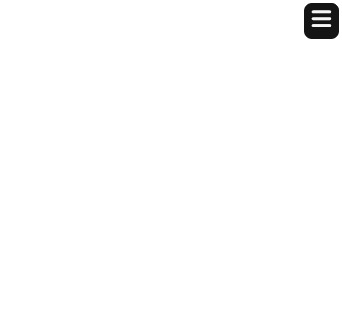

## DNA Devlog #8 - 6/30/2025
# Final changes - UI improvement

## Explanation

This is the final devlog before I ship it to Summer of Making.

In order to make it easier to customize one's DNA diagram, I made it possible to close and open the menu in the corner.

I also changed the colors of the DNA parts to be more vibrant and easy to see.

## Implementation

I made functions for closing and opening the menu.

Here's what it looks like when open.

Here it is when closed.

I also drew a logo for my project!

 
 

[<-- Previous Devlog](DNA_DEVLOG_7.md)